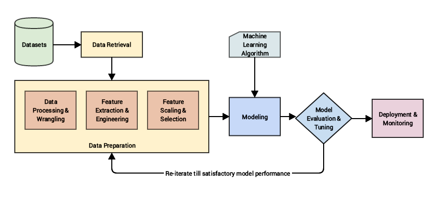

# Feature Engineering Handbook

<div align="center">


</div>

## 📖 Introduction

**Feature Engineering** and **Feature Selection** are critical data preparation tasks in machine learning that significantly impact model performance.

> **Feature Engineering** is the process of creating new features from existing data.
>
> **Feature Selection** is the process of selecting a subset of features from a dataset.

These techniques help key aspects of your ML pipeline:
-   **Improve Performance**: Create features more relevant to the target variable.
-   **Reduce Overfitting**: Limit the number of redundant features.
-   **Enhance Interpretability**: Simplifies models making them easier to understand.

<p align='center'>
  
</p>

## 📑 Table of Contents

-   [Roadmap](#%EF%B8%8F-roadmap)
-   [Feature Engineering Techniques](#-feature-engineering-techniques)
-   [Feature Selection Methods](#-feature-selection-methods)
    -   [Scikit-learn Classes & Functions](#scikit-learn-classes--functions-for-feature_selection)
    -   [Method Categories](#most-commonly-used-feature-selection-methods)
-   [Visualizations](#-visualizations-for-analysis)
-   [Code Snippets & Examples](#-code-snippets--examples)
-   [Model Selection & Evaluation](#-model-selection--evaluation)
-   [Contributing](#-contributing)
-   [License](#--license)
-   [Connect with Me](#-connect-with-me)

---

## 🛣️ Roadmap


---

## 🛠 Feature Engineering Techniques

Common strategies include:

1.  **Combination**: Creating new features by combining existing ones (e.g., summing two columns).
2.  **Transformation**: Mathematical transformations (e.g., square root, log, box-cox).
3.  **Discretization**: Converting continuous variables into bins or buckets.
4.  **Polynomial Features**: Powers of existing features (e.g., $age^2$).
5.  **Interaction Features**: Products of features (e.g., $age \times gender$).
6.  **Time Series Features**: Extracting time-based components (e.g., day of week, lag features).

---

## 🎯 Feature Selection Methods

### Scikit-learn Classes & Functions for `feature_selection`

| Class/Function | Description |
| :--- | :--- |
| `SelectKBest` | Selects the top K features based on a scoring function. |
| `chi2` | Chi-squared stats of non-negative features for classification tasks. |
| `SelectPercentile` | Selects the top percentile of features based on a scoring function. |
| `SelectFromModel` | Meta-transformer for selecting features based on importance weights. |
| `RFE` | Recursive Feature Elimination; removes weakest features iteratively. |
| `RFECV` | RFE with cross-validation to select the best number of features. |
| `SequentialFeatureSelector` | Transformer that performs sequential feature selection (forward or backward). |
| `mutual_info_regression` | Estimate mutual information for a continuous target variable. |
| `mutual_info_classification` | Estimate mutual information for a discrete target variable. |
| `f_regression` | Univariate linear regression tests returning F-value and p-value. |

### Most Commonly Used Feature Selection Methods

| Method Type | Description | Scikit-learn Class Examples |
| :--- | :--- | :--- |
| **Filter Methods** | Select features based on statistical measures (e.g., correlation, chi-square). Fast and generic. | `SelectKBest`, `SelectPercentile`, `chi2`, `f_regression`, `mutual_info_classif` |
| **Wrapper Methods** | Evaluate subsets of features by training a model. Computationally expensive but accurate. | `RFECV`, `SequentialFeatureSelector` |
| **Embedded Methods** | Perform feature selection during model training (e.g., regularization). | `SelectFromModel`, `LassoCV`, `RandomForestClassifier`, `XGBRegressor` |

---

## 📊 Visualizations for Analysis

Charts that assist in deciding which features to keep or engineer:

| Chart | Purpose |
| :--- | :--- |
| **Correlation Heatmap** | Identify redundant features by visualizing correlations. |
| **Box Plot** | Detect outliers and understand feature distribution. |
| **Scatter Plot Matrix** | Visualize relationships between multiple features and the target. |
| **Decision Tree Viz** | See which features the model prioritizes for splitting. |
| **PCA Plot** | Understand high-dimensional data structure and clusters. |
| **Feature Importance Plot** | Bar chart showing the relative importance scores of features. |

---

## 💻 Code Snippets & Examples

### 1. SelectKBest (Filter Method)
```python
from sklearn.datasets import load_iris
from sklearn.feature_selection import SelectKBest, chi2

# Load iris dataset
iris = load_iris()
X, y = iris.data, iris.target

# Apply SelectKBest feature selection
selector = SelectKBest(chi2, k=2)
X_new = selector.fit_transform(X, y)

# Print selected feature indices
print(selector.get_support(indices=True))
```

### 2. Chi-Squared Test
```python
from sklearn.feature_selection import chi2
from sklearn import datasets

X, y = datasets.load_wine(return_X_y=True)

selector = chi2(X, y)
# Note: For chi2 simply calculating, you don't strictly need a class context if just wanting scores, 
# but SelectKBest usually wraps it. Here is conceptual usage:
# selector = SelectKBest(chi2, k=5).fit(X, y)
# features = X.columns[selector.get_support()] 
# (Assuming X is a DataFrame for columns access)
```

### 3. Recursive Feature Elimination (RFE)
```python
from sklearn.feature_selection import RFE
from sklearn.ensemble import RandomForestRegressor

rf = RandomForestRegressor()
# Select top 5 features
rfe = RFE(rf, n_features_to_select=5)
rfe.fit(X_train, y_train)

print("Selected Features:", rfe.support_)
print("Ranking:", rfe.ranking_)
```

### 4. RFECV (RFE with Cross-Validation)
```python
from sklearn.feature_selection import RFECV
from sklearn.linear_model import LogisticRegression

selector = RFECV(estimator=LogisticRegression(), step=1, cv=5, scoring='accuracy')
selector.fit(X, y)

print("Optimal number of features: %d" % selector.n_features_)
print("Selected features indices:", selector.get_support(indices=True))
```

### 5. Sequential Feature Selector
```python
from sklearn.feature_selection import SequentialFeatureSelector
from sklearn.neighbors import KNeighborsClassifier

knn = KNeighborsClassifier(n_neighbors=3)
sfs = SequentialFeatureSelector(knn, n_features_to_select=2)
X_new = sfs.fit_transform(X, y)

print(sfs.get_support(indices=True))
```

### 6. Feature Importance from Trees
```python
from sklearn.ensemble import RandomForestClassifier
import pandas as pd

model = RandomForestClassifier()
model.fit(X, y)

# Combine feature names and their importance
feature_importances = pd.Series(model.feature_importances_, index=X.columns)
print(feature_importances.sort_values(ascending=False).head(5))
```

---

## 📈 Model Selection & Evaluation

The `sklearn.model_selection` module is essential for validating your feature engineering efforts.

| Function | Description |
| :--- | :--- |
| `train_test_split` | Split arrays or matrices into random train and test subsets. |
| `cross_val_score` | Evaluate a score by cross-validation. |
| `cross_validate` | Evaluate multiple metric(s) by cross-validation. |
| `GridSearchCV` | Exhaustive search over specified parameter values for an estimator. |
| `RandomizedSearchCV` | Randomized search on hyper parameters. |
| `KFold` / `StratifiedKFold` | K-Folds cross-validator (Stratified preserves class percentage). |

### Example: Hyperparameter Tuning with `GridSearchCV`

```python
from sklearn.model_selection import GridSearchCV
from sklearn.ensemble import RandomForestClassifier
from sklearn.datasets import make_classification

# Generate dummy data
X, y = make_classification(n_samples=1000, n_features=20)

# Define model and parameter grid
rf = RandomForestClassifier()
param_grid = {
    'n_estimators': [50, 100, 200],
    'max_depth': [None, 10, 20],
    'min_samples_split': [2, 5]
}

# Setup GridSearchCV
grid_search = GridSearchCV(estimator=rf, param_grid=param_grid, cv=5, n_jobs=-1, scoring='accuracy')

# Fit and print best results
grid_search.fit(X, y)
print(f"Best Parameters: {grid_search.best_params_}")
print(f"Best Score: {grid_search.best_score_:.4f}")
```

---

## 📦 Other Powerful Libraries

Beyond Scikit-learn, several specialized libraries excel at specific feature engineering tasks.

### 1. [Category Encoders](https://contrib.scikit-learn.org/category_encoders/)
Advanced encoding methods for categorical variables, often superior to standard OneHot or Label encoding.

| Encoder | Description |
| :--- | :--- |
| `BinaryEncoder` | Encodes categorical features into binary codes (fewer columns than OneHot). |
| `TargetEncoder` | Encodes categories based on the mean of the target variable (great for high cardinality). |
| `WOEEncoder` | Weight of Evidence encoding; measures the "strength" of a grouping for separating good and bad. |
| `HashingEncoder` | Hash hashing of categories; useful for high-cardinality and online learning. |

```python
import category_encoders as ce
import pandas as pd

X = pd.DataFrame({'city': ['New York', 'Paris', 'Tokyo', 'Paris', 'New York'], 'price': [200, 150, 300, 160, 210]})
y = [1, 0, 1, 0, 1]  # Target

# Target Encoding Example
encoder = ce.TargetEncoder(cols=['city'])
X_encoded = encoder.fit_transform(X, y)

print(X_encoded)
```

### 2. [Feature-engine](https://feature-engine.trainindata.com/)
A library specifically designed for feature engineering with a scikit-learn compatible API.

| Module | Description |
| :--- | :--- |
| `imputation` | Methods like `MeanMedianImputer`, `EndTailImputer` for handling missing data. |
| `encoding` | `RareLabelEncoder` (groups rare categories), `MeanEncoder`, `CountFrequencyEncoder`. |
| `discretisation` | `EqualFrequencyDiscretiser`, `DecisionTreeDiscretiser`. |
| `outliers` | `Winsorizer` to cap outliers at given quantiles. |

```python
from feature_engine.encoding import RareLabelEncoder
import pandas as pd

# Data with rare category 'E'
X = pd.DataFrame({'category': ['A', 'A', 'B', 'B', 'C', 'C', 'D', 'D', 'E']})

# Group categories occurring in less than 20% of rows into 'Rare'
encoder = RareLabelEncoder(tol=0.2, n_categories=1, replace_with='Rare')
X_encoded = encoder.fit_transform(X)

print(X_encoded['category'].value_counts())
```

### 3. [Imbalanced-learn](https://imbalanced-learn.org/stable/)
While primarily for sampling, it is crucial for feature prep in imbalanced datasets.

| Method | Description |
| :--- | :--- |
| `SMOTE` | Synthetic Minority Over-sampling Technique; generates synthetic samples. |
| `NearMiss` | Under-sampling based on k-nearest neighbors. |
| `ADASYN` | Adaptive Synthetic sampling; focuses on "hard to learn" examples. |

```python
from imblearn.over_sampling import SMOTE
from collections import Counter

X, y = make_classification(n_classes=2, weights=[0.9, 0.1], n_samples=1000)
print(f"Original class distribution: {Counter(y)}")

# Resample using SMOTE
sm = SMOTE(random_state=42)
X_res, y_res = sm.fit_resample(X, y)

print(f"Resampled class distribution: {Counter(y_res)}")
```

### 4. [SHAP (SHapley Additive exPlanations)](https://shap.readthedocs.io/en/latest/)
Although an interpretability tool, SHAP values are powerful for **feature selection** by understanding true contribution.

```python
import shap
import xgboost as xgb

# Train a model
model = xgb.XGBClassifier().fit(X, y)

# Explain predictions
explainer = shap.Explainer(model)
shap_values = explainer(X)

# Visualize feature importance (beeswarm plot)
shap.plots.beeswarm(shap_values)
```

## 🤝 Contributing

This repository is open source and contributions are welcome! 
If you have any ideas, hacks, tips, or find errors:
1.  Fork the repository.
2.  Create a branch.
3.  Submit a Pull Request.
4.  Or simply open an **Issue**.

---

## ⚖️ License

This project is licensed under the **MIT License** - see the [LICENSE](LICENSE) file for details.

---

<div align="center">

#### Connect with me

[](https://twitter.com/F4izy)
[](https://www.linkedin.com/in/mohd-faizy/)
[](https://ai.stackexchange.com/users/36737/faizy)
[](https://github.com/mohd-faizy)

</div>


